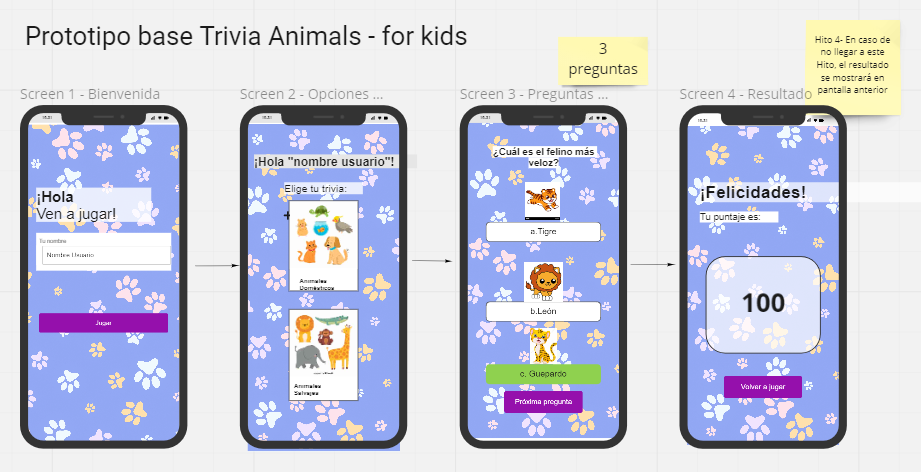
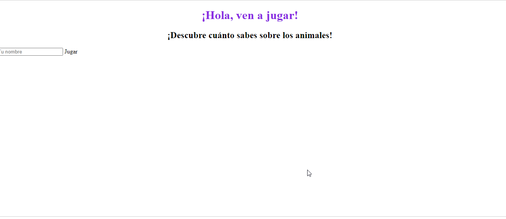
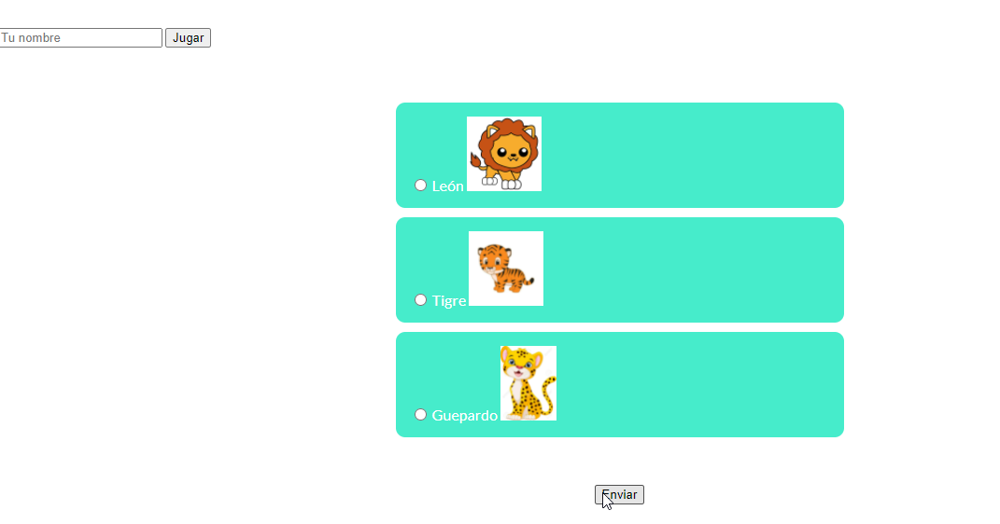
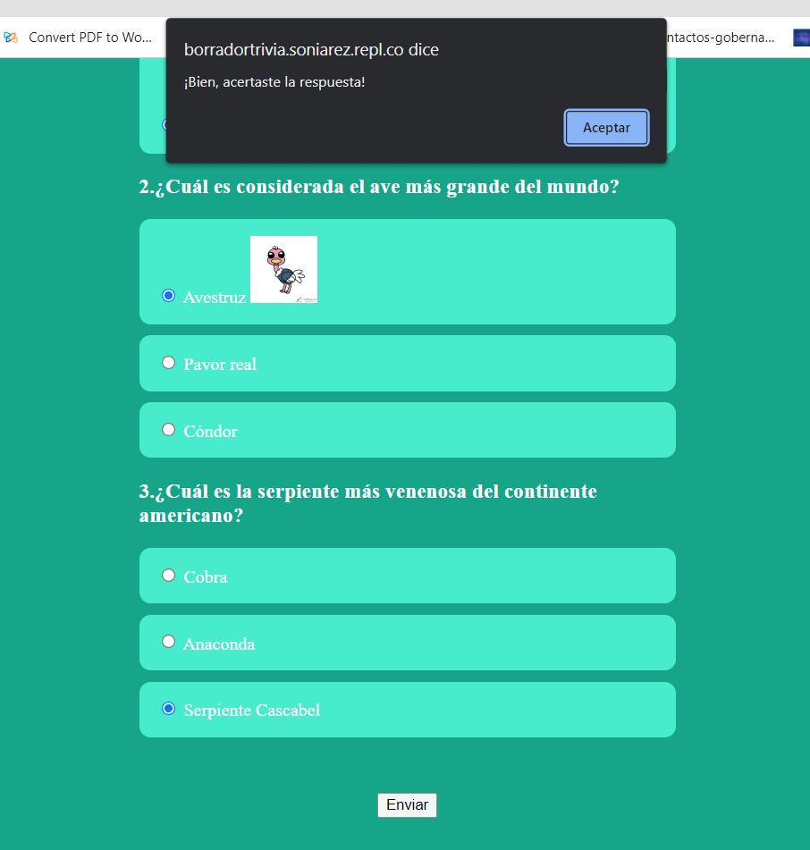
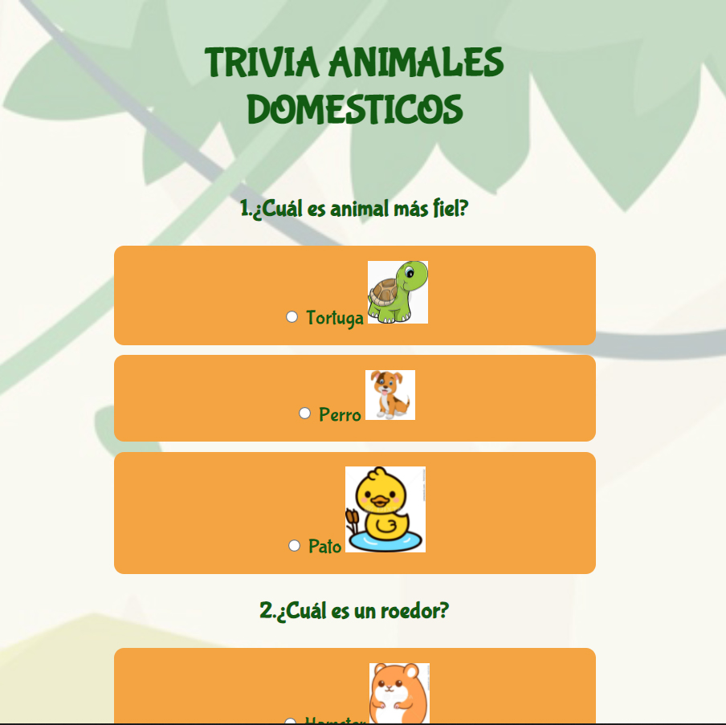
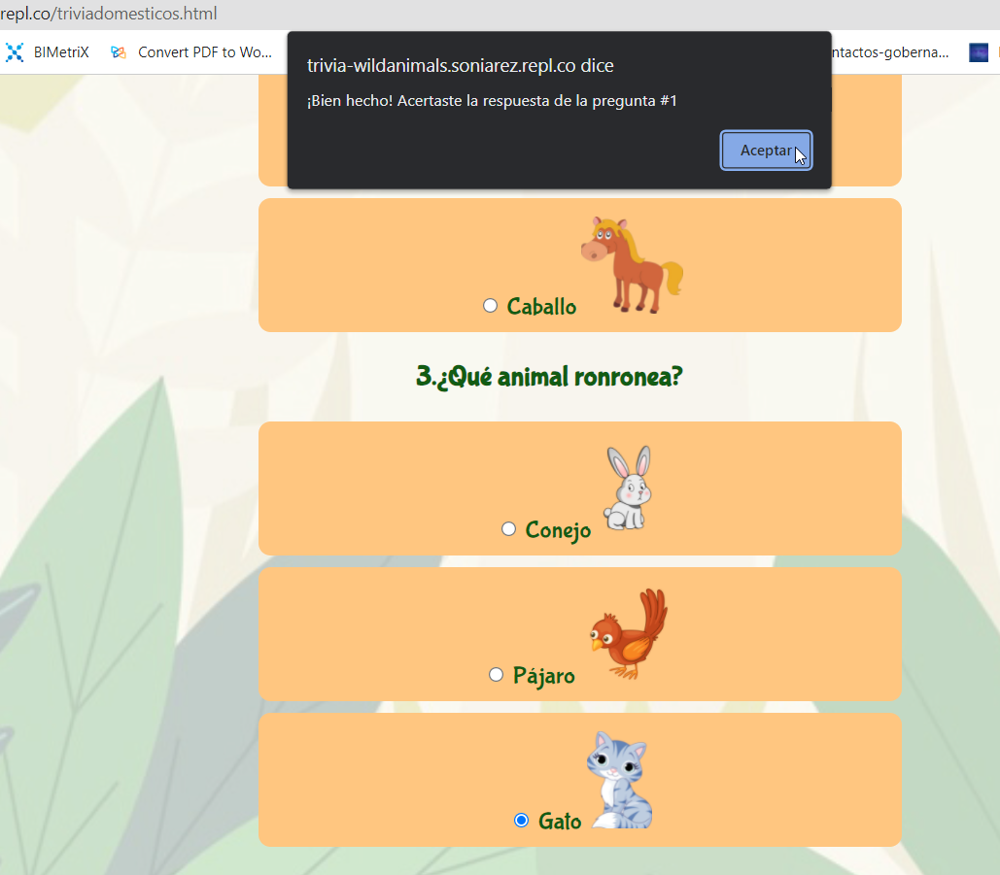
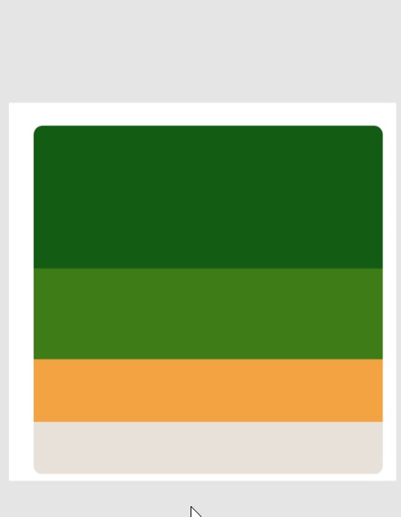
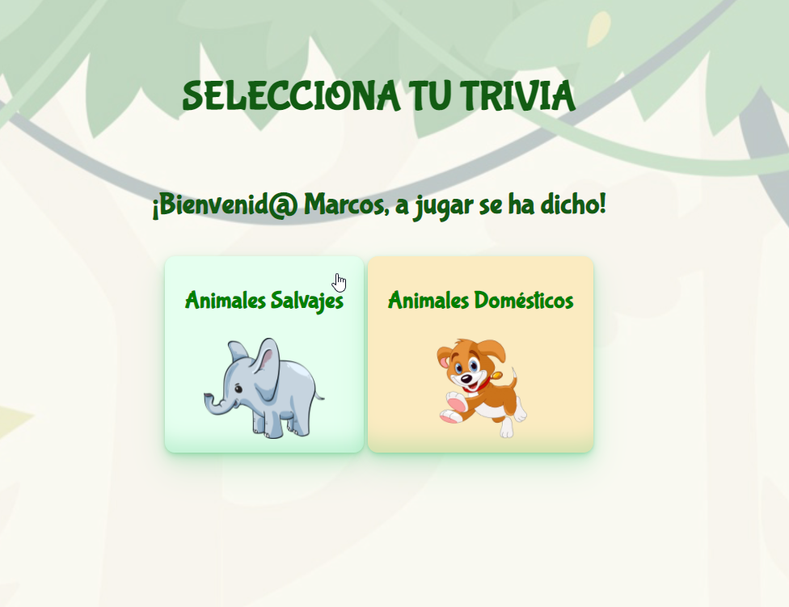

# Trivia Animals
El target de esta trivia son niños de 7+años, para que jueguen y aprendan algunos datos de interés sobre los animales. A continuación un detalle de lo realizado:

## Lunes:
Diseño de prototipo en Miro, creación de la encuesta, mediante form y casilla "tu nombre". Las opciones de pregunta se muestra con radio buttons.
Este día llegamos hasta el Hito 1, generando una trivia de una sola screen, la cual indicaba las repuestas correctas mediante alert, y también un alert en caso de respuesta incorrecta, indicando cual era la respuesta acertada.

###### Link a flujo de prototipo: https://miro.com/app/board/uXjVOJXf7Ik=/?invite_link_id=761778943690

###### Primera iteración trabajada: 
Creamos una pantalla de bienvenida, en la cual el usuario podía ingresar su nombre, pero aún no conseguíamos hacer funcionar el botón de "jugar":

##### Segunda iteración trabajada:
Ya logramos hacer funcionar el botón de "Jugar" y logramos hacer y envió de respuestas, dando un formato css básico:

## Martes:
Ya que contamos con un MVP hasta el Hito 1, empezamos a trabajar en el Hito 2, para crear una screen de inicio que solicitara el nombre del usuario, mediante un input del usuario, y ejecutará un button on click.De esta primera screen se pasa a una segunda screen que permite al usuario seleccionar de dos opciones de trivia: Animales Salvajes y Animales Domésticos. Cada una contiene tres preguntas con tres opciones de respuesta. Hasta ahora los resultados los mostramos con un alert.

##### Tercera iteracición trabajada:
Logramos que la app indicara al usuario si su respuesta está correcta o no, mediante un alert.

También trabajamos en el estilo del documento, para dejarlo visualmente más atractivo, con un color verde llamativo para los niños. 

## Miércoles:
Este día trabajamos por alcanzar el hito 3 y mejorar el estilo de nuestra trivia, por ejemplo, imágenes sin fondo blanco. 

Otro reto alcanzado fue que la trivia indicara al usuario el puntaje logrado, y también logramos que en la segunda screen se muestre el nombre del usuario ingresado:

Las respuestas contenían imágenes con fondo blanco

Ya se muestra el puntaje alcanzado por el usuario:

## Jueves:
Trabajamos en el style final de nuestra trivia y mejora en la estética de los botones de "jugar" "enviar" ,jugar de nuevo", y paleta de colores a utilizar.

## Reflexiones de esta experiencia:
Para nosotras, esta ha sido una experiencia muy retadora, pero sobre todo enriquecedora. Partimos el día lunes con cero conocimiento de programación, y a este día nos sentimos muy orgullosas de nosotras mismas, de todo lo aprendido y realizado en tan poco tiempo, de hecho estábamos averiguando como poner los alert en popup, estuvimos muy cerca de incorporarlo para la demo pero vamos aprender igual porque estamos muy motivadas en seguir adquiriendo conocimientos del mundo de la informática. 
